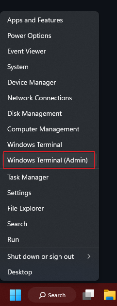

# PowerShell Script: User Data Backup

This PowerShell script allows you to copy user data from specific folders (Desktop, Documents, and Downloads) to a destination drive, optionally including only student data. The script provides a convenient way to back up user data while excluding unnecessary folders.

## Prerequisites

- Windows operating system
- PowerShell (version 3.0 or later)

## Running the Script

To run the script, follow these steps:

1. Press the **Windows key + X** on your keyboard.
2. From the context menu that appears, select **Windows PowerShell (Admin)**. This opens an administrative PowerShell window with elevated privileges.

   

3. In the administrative PowerShell window, navigate to the directory where the script is saved using the `cd` command. For example:

   ```powershell
   cd C:\Scripts
   ```

4. Execute the script by entering the following command:

   ```powershell
   .\user_data_backup.ps1
   ```

   Replace `user_data_backup.ps1` with the actual name of the script file.

5. The script will prompt you with the question "Copy only student data? (Y/N)". Enter your response and press **Enter**. If you enter "Y", only user data for profiles whose names begin with a number will be copied. If you enter "N", data for all users will be copied.

6. After entering your response, the script will prompt you to enter the destination drive letter (e.g., D:). Type the drive letter and press **Enter**.

7. The script will create a timestamped backup folder on the specified destination drive and copy the user data into individual folders within that backup folder.

   

8. Once the script completes, you can verify that the user data has been copied to the backup folder on the specified drive.

> **Note:** Ensure that you have the necessary permissions to access the user data and the destination drive. Additionally, test the script in a controlled environment or on a small scale before running it in a production environment to ensure it behaves as expected.
```
